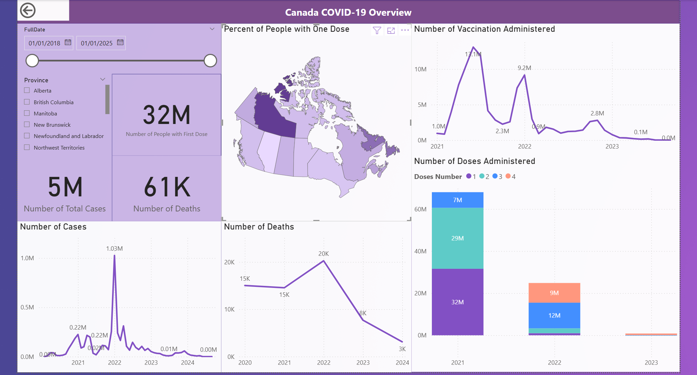

# Canada COVID-19 Analytics Project

A full end-to-end data pipeline that ingests Canadian COVID-19 case, death, vaccination, and population data, transforms it into a star schema, and presents interactive visualizations in Power BI.

---

## Table of Contents

1. [Overview](#overview)  
2. [Data Sources](#data-sources)  
3. [Solution Architecture](#solution-architecture)  
4. [High-Level Data Flow](#high-level-data-flow)  
5. [Entity Relationship Diagram (ERD)](#entity-relationship-diagram-erd)  
6. [Implementation Steps](#implementation-steps)  
7. [Screenshots](#screenshots)  
8. [How to Run](#how-to-run)  

---

## Overview

This project demonstrates a complete data engineering and analytics workflow using Azure and Databricks, culminating in a Power BI dashboard that tracks:

- Weekly COVID-19 cases and deaths by province  
- Vaccination progress by week  
- Percent of population vaccinated  
- Population-adjusted trends

---

## Data Sources

- **COVID-19 Cases & Deaths:**  
  https://open.canada.ca/data/en/dataset/261c32ab-4cfd-4f81-9dea-7b64065690dc/resource/39434379-45a1-43d5-aea7-a7a50113c291

- **Vaccine Administration:**  
  https://health-infobase.canada.ca/covid-19/vaccine-administration/

- **Population by Province:**  
  https://www150.statcan.gc.ca/t1/tbl1/en/tv.action?pid=1710000901

---

## Solution Architecture

---

## High-Level Data Flow

---

## Entity Relationship Diagram (ERD)

---

## Implementation Steps

### 1. Upload to GitHub  
All scripts, images, and notebooks are version-controlled in GitHub.

### 2. Create Azure Resources

- Azure Data Lake (Gen2)
- Azure Data Factory
- Azure Databricks
- Azure Synapse / SQL Database

### 3. Load & Clean Raw Data

- Used Azure Data Factory to load raw CSV files to the lake  
- Used PySpark in Databricks to clean and transform into snow flake schema:
  - Replaced `"–"` and blanks with null
  - Filled nulls with 0 where appropriate
  - Removed duplicates
  - Created **star schema**

### 4. Write Clean Data Back to Data Lake

### 5. Move to Azure SQL

- Loaded cleaned CSV/Parquet files into SQL tables using Synapse.

### 6. Build Dashboard in Power BI

- Pulled from Azure SQL
- Built dynamic filters, KPIs, line charts, filled maps, and calculated measures

---

## Screenshots

### 💻 Data Factory Pipeline

### 🔧 Databricks Notebook

### 📊 Power BI Model

### 📈 Final Dashboard

---

## How to Run

1. Clone this repo  
2. Upload raw data to your own Azure Data Lake  
3. Run Databricks notebooks to clean & transform  
4. Push output to `transformed-data` zone  
5. Ingest to Azure SQL using Synapse or Data Factory  
6. Open Power BI report and refresh  
7. Explore filters, maps, and charts  

